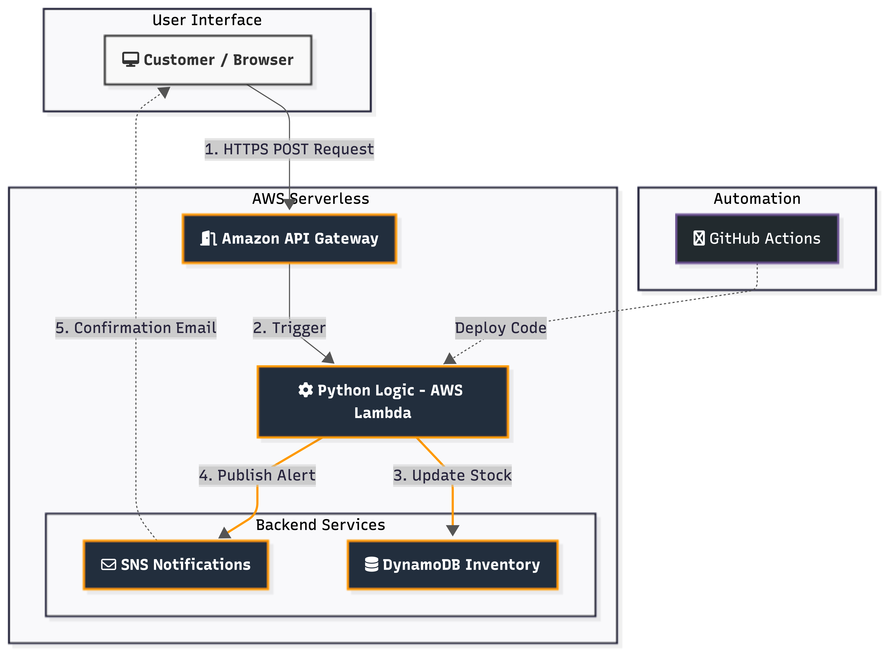

# 🚀 Ghost Checkout: Serverless Inventory Engine on AWS

## 🌟 Overview
**Ghost Checkout** (SnapStock Cloud) is a high-performance, event-driven serverless engine designed to handle e-commerce transactions and real-time inventory management. By moving away from traditional monolithic architectures, this project leverages the power of **AWS Lambda** and **DynamoDB** to provide a scalable, cost-effective solution with near-zero operational overhead.

## 🏗️ Architecture
The system is built on a modern **Event-Driven Architecture**:
1. **Trigger:** A push to the `main` branch or a manual API call.
2. **Compute:** **AWS Lambda** processes the logic (Order validation & Inventory check).
3. **Storage:** **Amazon DynamoDB** handles atomic updates to ensure data consistency.
4. **Notification:** **Amazon SNS** triggers instant alerts for low-stock scenarios.
5. **CI/CD:** **GitHub Actions** automates the entire deployment pipeline to AWS.

> **Note:** 

## 🛠️ Tech Stack
- **Cloud Provider:** AWS (Lambda, DynamoDB, SNS, IAM)
- **Runtime:** Python 3.x
- **CI/CD:** GitHub Actions
- **Database:** NoSQL (Amazon DynamoDB)

## 🚀 Key Features
- **Serverless Scaling:** Automatically scales with the number of requests.
- **Atomic Transactions:** Ensures inventory accuracy even during high-traffic spikes.
- **Automated Deployments:** Fully integrated CI/CD pipeline; code changes go live in seconds.
- **Proactive Monitoring:** Real-time SNS alerts for inventory re-stocking.

## 📈 Performance
- **Deployment Speed:** ~20 seconds via GitHub Actions.
- **Execution Latency:** Sub-second processing for inventory updates.
- **Operational Cost:** $0 (Optimized for AWS Free Tier).

## 👩‍💻 Author
**Khuloud AlQarni**  
*Software Engineering Student at Holberton School*  
[LinkedIn Profile](https://www.linkedin.com/in/khulud-alqarni-aa793b257)

---
*Built with ❤️ and a passion for Cloud Architecture.*

